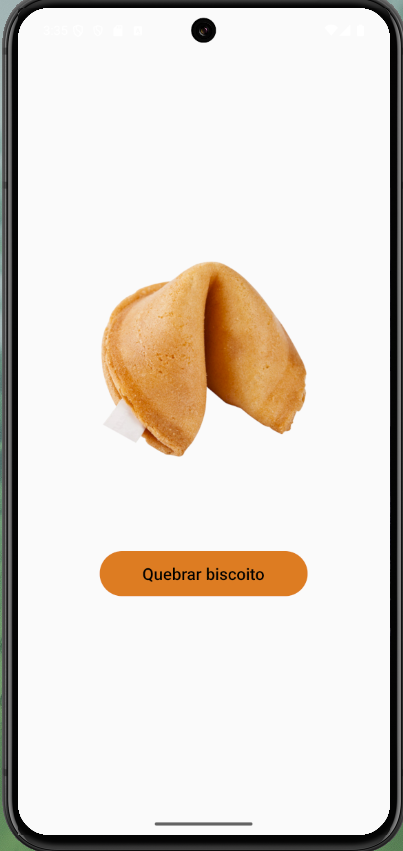
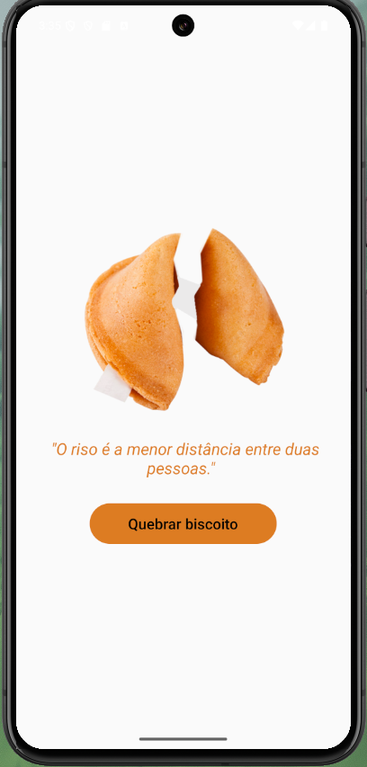

# Biscoito da Sorte

Este é um projeto desenvolvido com **React Native**, criado durante o curso de React Native do Matheus Fraga para reforçar conceitos fundamentais do desenvolvimento mobile. 

## Sobre o Projeto

O aplicativo **Biscoito da Sorte** simula um biscoito da sorte virtual. Ao clicar no botão, um biscoito se quebra e exibe uma mensagem aleatória de motivação.

## O que foi aprendido

Durante o desenvolvimento deste projeto, foram aplicados conceitos essenciais do **React Native**, incluindo:

- **Criação de Componentes de Classe** em React.
- **Manipulação de estado (state)** para alterar dinamicamente a interface.
- **Eventos e manipulação de clique (onPress)** em botões.
- **Uso de Imagens locais** dentro do aplicativo.
- **Estilização com StyleSheet** para organização e layout dos elementos.

## Tecnologias Utilizadas

- **React Native**
- **JavaScript (ES6+)**

## Capturas de Tela

---

Feito com ❤️ por **Swetony Ancelmo**
